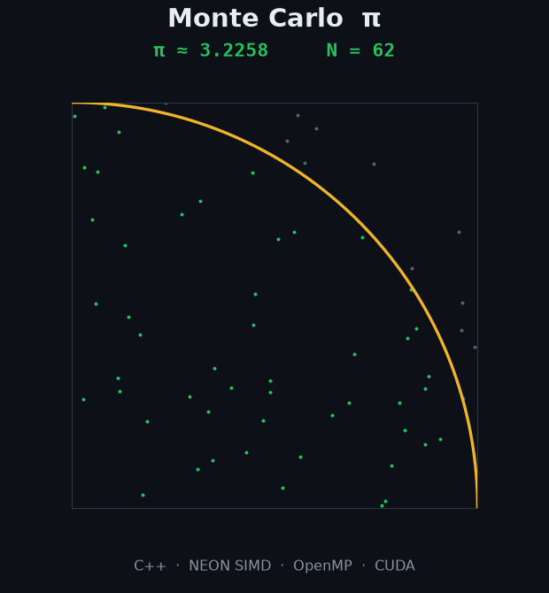
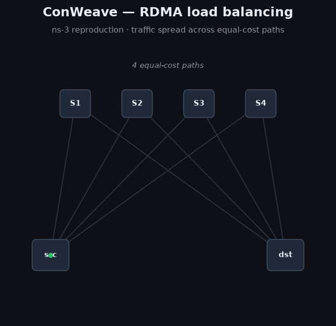

# Hi there 👋

I am a Master's High-Performance Computing Engineering student at Politecnico di Milano, having previously completed my Bachelor's in Computer Engineering at the same university.

Low-level performance engineering, computer architecture, GPU optimization, and data-center networking are the topics that spark my interest. Here are some projects I've built:

<table>
<tr>
<td align="center" width="50%">

  
<a href="https://github.com/YoussefElaamraoui/Pi-Montecarlo-optimisation">Monte Carlo π Optimization</a>
 
C++ · NEON SIMD · OpenMP · CUDA — up to 217× on CPU, 180 Gsample/s on GPU
</td>
<td align="center" width="50%">

  
<a href="https://github.com/lucabord/conweave-reproduction">ConWeave Reproduction</a>
 
ns-3 · RDMA data-center load balancing
</td>
</tr>
</table>

